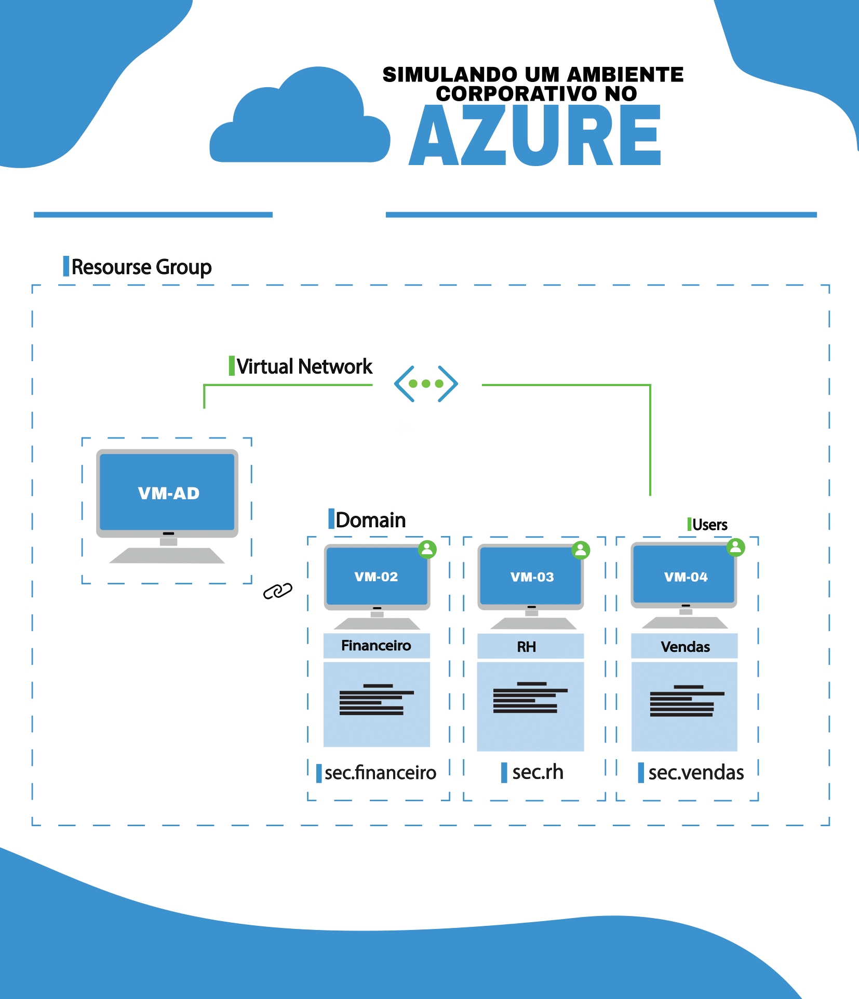

# ☁️ Infraestrutura virtual no Azure  

## 📖 Este projeto acadêmico tem como objetivo criar uma infraestrutura virtual utilizando o Microsoft Azure, simulando um ambiente corporativo simples.

## 🧩 Etapas do Projeto

1. Criar e configurar VNET.
2. Implantar a VM com Windows Server.
3. Instalar e configurar o Active Directory Domain Services (AD DS).
4. Criar OUs e GPOs no domínio.
5. Configurar VM cliente (Windows).
6. Ingressar a VM clientes no domínio.
7. Aplicar e testar as GPOs nas VMs clientes.

## 🛠️ Tecnologias Utilizadas

