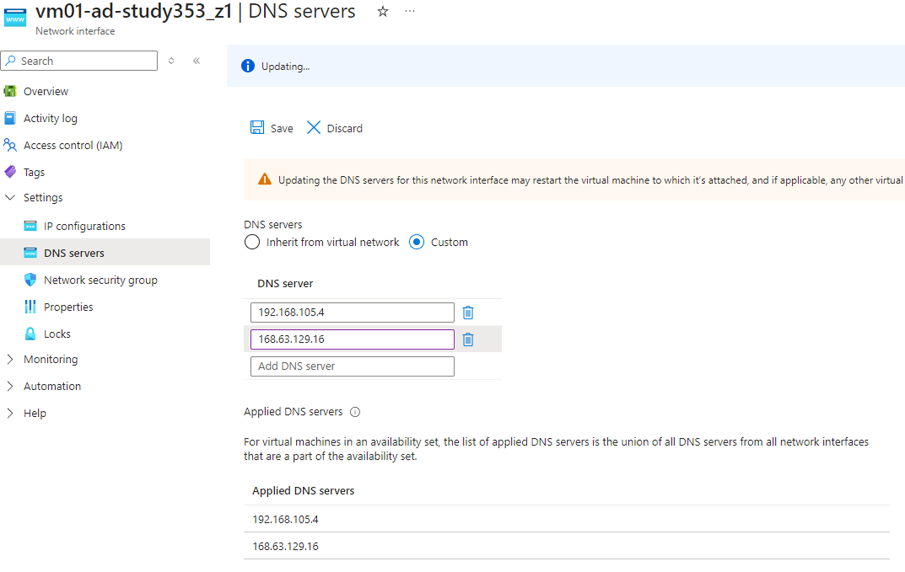

# 📜Etapas: Infraestrutura virtual no Azure

###### 🔺Esta é uma documentação para fins acadêmicos. Não é um tutorial.

### 1. A primeira etapa consiste na criação de um Resource Group (RG), para agrupar todos o serviços que serão utilizados.

### 2. Com o RG criado, é necessário uma Virtual Network (VNET), que será responsável pela comunicação entre as máquinas virtuais (VMs), no padrão ‘192.168.105.0/24'.

###### 🔺 Os 4 primeiros IPs são reservados pelo Azure, logo, no meu padrão, minha primeira VM só poderá ser criado a partir do 192.168.105.4. Sendo assim, ficará da seguinte maneira:

| IP                  | Descrição             |
| ------------------- | --------------------- |
| 192.168.105.0 >     | Identificação da Vnet |
| 192.168.105.1 >     | Gateway               |
| 192.168.105.2 e 3 > | Serviços do Azure     |
| 192.168.105.255 >   | Broadcast             |

### 3. Com a VNET criada, criei minha primeira VM, onde a imagem será o Windows Server 2022, para ter acesso ao Server Manager, nas seguintes configurações:

### 3.1 <b>Network Interface:</b> direcionei à minha VNET e Subnet criada anteriormente. Conexão será por RDP.

### 3.2. <b>IP Config:</b>o IP será estático, pois preciso que ele seja fixo, e terá o ip 192.168.105.4.

### 3.3. Finalizando, baixei o arquivo RDP e loguei com a conta criada durante a criação da VM.

## 🖥️ Configuração da VM01-AD

### 1. Ao abrir, coletei DNS Server a partir do comando ipconfig /all. Neste caso, é o 168.63.129.16 (genérico do Azure).

### 2. Com os IPs coletados, adicionarei eles na NIC (Newtork Interface Card) da VM01.

###### 🔺Isso será excluído posteriormente. Usei o DNS do Azure pois ainda não criei o meu, que será o IPV4 da VM01.

### 2.1. Após um ipconfig /renew e ipconfig /all, será visível também o IPV4 que adicionamos na NIC da VM01.

## 🛠️ Server Manager

### 1. No Server Manager fui em 'Add Roles and Features' > 'Servers Roles' > 'Active Directory Domain Services' para instalar o AD DS.

### 1.2 Em 'Add a new forest' é possível criar o nome do meu domínio raiz, neste caso, 'STUDY.COM'.

## 🖥️ VNET

### 1. Com meu DNS criado após a instalação do AD DS, fui no NIC da minha VNET e apontei o IPV4 da VM01 como meu DNS primário. Assim, todas as VMS vinculadas a VNET herdará o DNS.

###### 🔺O DNS genérico da Azure foi removido da VM01.

## 🖥️ Configuração da VM02-CLIENT

### 1. Esta será as config VM de um colaborador do financeiro, que estará em nosso domínio e com acesso a GPO específica.

### 2. Após isso, bastou adicioná-la ao nosso domínio

###### 🔺Assim como a VM-AD, a VM-CLIENT foi vinculada a VNET.

### 2.1 Importante ativar o Remote Desktop para Domain Users, para que usuários criados no AD possam logar nesta VM.

## 🗂️ Active Directory

### 1. Com a VM02 inserida ao domínio, já é possível visualizá-la na OU "Computers".

### 2. Para manter um padrão de organização, criei uma OU para o setor da minha VM, e duas Sub-OUs, uma para a máquinas da área e outra para os usuários.

## 🛡️ GPOs

### 1. No Windows Server > Group Policy Managment, criei uma GPO chamado 'sec.financeiro', vinculada a Sub-OU "user" da OU 'financeiro'.

### 2. Em Scope, a GPO só poderá ser aplicada ao Domain Admins e ao próprio grupo 'sec.financeiro', permissões essas alteradas no Delegation.

### 3. Antes de ir ao Drive Map para criar a GPO, a pasta 'Financeiro' foi criada no Documents da minha VM01 e compartilhada devidamente

### 4. Com isso, a GPO foi criada com as especificações abaixo:

### 5. No CMD da VM02 (com o usuario financeiro logado), ao dar um 'gpudate /force', as políticas foram atualizadas e já é possível visualizar a GPO criada exclusiva para o setor Financeiro.

